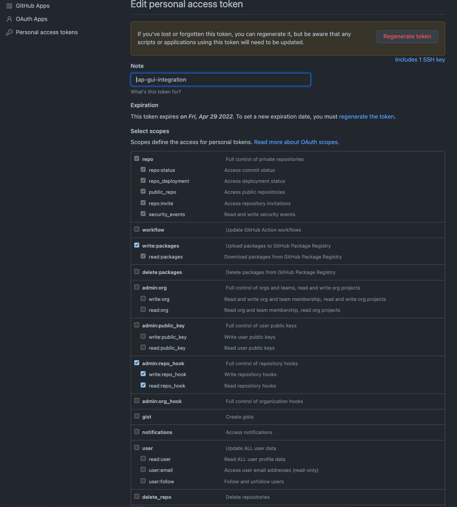

#  TAP Installation with Testing_Scanning Supply-Chain Specifics Guide

Please follow all other steps as mentioned in [TAP-Installation-Tanzu-Specifics-Guide.md](./TAP-Installation-Tanzu-Specifics-Guide.md) wherever necessary.
## Upgrading TAP

Old TAP Version :1.0.0

New TAP Version: 1.0.3

Follow [upgrading.md](https://github.com/pivotal/docs-tap/blob/32b3257f5d216baf8fd092798db8eeeb6271db77/upgrading.md)

Use below commands

```
tanzu package repository update tanzu-tap-repository \
    --url registry.tanzu.vmware.com/tanzu-application-platform/tap-packages:1.0.3  \
    --namespace tap-install

tanzu package repository get tanzu-tap-repository --namespace tap-install

tanzu package installed update tap100-sc-full -p tap.tanzu.vmware.com -v 1.0.3  --values-file tap-values-full-supply-chain.yaml -n tap-install

tanzu package installed list --namespace tap-install
```


## TAP Profile

1. Create a TAP Profile

    File name: tap-values-full-supply-chain.yaml

    ```yaml
      ---
      #@ load("@ytt:data", "data")
      ---
      profile: full
      ceip_policy_disclosed: true # Installation fails if this is set to 'false'
      buildservice:
        kp_default_repository: #@ "{}/{}/build-service".format(data.values.container_tbs_ecr_registry.hostname, data.values.container_tbs_ecr_registry.repository)
        kp_default_repository_username: #@ data.values.container_tbs_ecr_registry.username
        kp_default_repository_password: #@ data.values.container_tbs_ecr_registry.password
        tanzunet_username: #@ data.values.tanzunet.username
        tanzunet_password: #@ data.values.tanzunet.password
        enable_automatic_dependency_updates: false
        descriptor_name: full

      supply_chain: testing_scanning

      ootb_supply_chain_testing_scanning:
        registry:
          server: #@ data.values.container_workload_ecr_registry.hostname
          repository: #@ data.values.container_workload_ecr_registry.repository
        gitops:
          ssh_secret: ""

      learningcenter:
        ingressDomain: #@ "learning-center.{}".format(data.values.aws.domain)

      tap_gui:
        ingressEnabled: true
        ingressDomain: #@ data.values.aws.domain
        service_type: ClusterIP # NodePort for distributions that don't support LoadBalancer
        app_config:
          supplyChain:
            enablePlugin: true
          auth:
            allowGuestAccess: true
          backend:
            baseUrl: #@ "http://tap-gui.{}".format(data.values.aws.domain)
            cors:
              origin: #@ "http://tap-gui.{}".format(data.values.aws.domain)
          app:
            baseUrl: #@ "http://tap-gui.{}".format(data.values.aws.domain)

      metadata_store:
        app_service_type: LoadBalancer

      contour:
        envoy:
          service:
            type: LoadBalancer

      cnrs:
        domain_name: #@ "cnr.{}".format(data.values.aws.domain)

      grype:
        namespace: #@ data.values.workload.namespace
        targetImagePullSecret: registry-credentials

    ```


1. TAP Install

    Follow [GUID-install.html#install-package](https://docs-staging.vmware.com/en/Tanzu-Application-Platform/1.0/tap/GUID-install.html#install-package)


    - Install

    ```
    export TAP_VERSION=1.0.3
    tanzu package install tap100-sc-full -p tap.tanzu.vmware.com -v $TAP_VERSION --values-file tap-values-full-supply-chain.yaml -n tap-install 

    OR

    tanzu package installed update tap100-sc-full -p tap.tanzu.vmware.com -v 1.0.3  --values-file tap-values-full-supply-chain.yaml -n tap-install
    ```

    - Verify

    ```
    tanzu package installed list -A
    tanzu package installed get tap100-eks -n tap-install
    ```

    ```
     tanzu package installed list -A
    \ Retrieving installed packages...
      NAME                                PACKAGE-NAME                                         PACKAGE-VERSION  STATUS               NAMESPACE
      accelerator                         accelerator.apps.tanzu.vmware.com                    1.0.3            Reconcile succeeded  tap-install
      api-portal                          api-portal.tanzu.vmware.com                          1.0.9+sr.1       Reconcile succeeded  tap-install
      appliveview                         run.appliveview.tanzu.vmware.com                     1.0.3            Reconcile succeeded  tap-install
      appliveview-conventions             build.appliveview.tanzu.vmware.com                   1.0.2            Reconcile succeeded  tap-install
      buildservice                        buildservice.tanzu.vmware.com                        1.4.3            Reconcile succeeded  tap-install
      cartographer                        cartographer.tanzu.vmware.com                        0.2.2            Reconcile succeeded  tap-install
      cert-manager                        cert-manager.tanzu.vmware.com                        1.5.3+tap.1      Reconcile succeeded  tap-install
      cnrs                                cnrs.tanzu.vmware.com                                1.1.1            Reconcile succeeded  tap-install
      contour                             contour.tanzu.vmware.com                             1.18.2+tap.1     Reconcile succeeded  tap-install
      conventions-controller              controller.conventions.apps.tanzu.vmware.com         0.5.2            Reconcile succeeded  tap-install
      developer-conventions               developer-conventions.tanzu.vmware.com               0.5.0            Reconcile succeeded  tap-install
      fluxcd-source-controller            fluxcd.source.controller.tanzu.vmware.com            0.16.3           Reconcile succeeded  tap-install
      grype                               grype.scanning.apps.tanzu.vmware.com                 1.0.1            Reconcile succeeded  tap-install
      image-policy-webhook                image-policy-webhook.signing.apps.tanzu.vmware.com   1.0.2            Reconcile succeeded  tap-install
      learningcenter                      learningcenter.tanzu.vmware.com                      0.1.1            Reconcile succeeded  tap-install
      learningcenter-workshops            workshops.learningcenter.tanzu.vmware.com            0.1.1            Reconcile succeeded  tap-install
      metadata-store                      metadata-store.apps.tanzu.vmware.com                 1.0.2            Reconcile succeeded  tap-install
      ootb-delivery-basic                 ootb-delivery-basic.tanzu.vmware.com                 0.6.1            Reconcile succeeded  tap-install
      ootb-supply-chain-testing-scanning  ootb-supply-chain-testing-scanning.tanzu.vmware.com  0.6.1            Reconcile succeeded  tap-install
      ootb-templates                      ootb-templates.tanzu.vmware.com                      0.6.1            Reconcile succeeded  tap-install
      scanning                            scanning.apps.tanzu.vmware.com                       1.0.1            Reconcile succeeded  tap-install
      service-bindings                    service-bindings.labs.vmware.com                     0.6.1            Reconcile succeeded  tap-install
      services-toolkit                    services-toolkit.tanzu.vmware.com                    0.5.1            Reconcile succeeded  tap-install
      source-controller                   controller.source.apps.tanzu.vmware.com              0.2.1            Reconcile succeeded  tap-install
      spring-boot-conventions             spring-boot-conventions.tanzu.vmware.com             0.3.0            Reconcile succeeded  tap-install
      tap-gui                             tap-gui.tanzu.vmware.com                             1.0.2            Reconcile succeeded  tap-install
      tap-telemetry                       tap-telemetry.tanzu.vmware.com                       0.1.4            Reconcile succeeded  tap-install
      tap100-sc-full                      tap.tanzu.vmware.com                                 1.0.3            Reconcile succeeded  tap-install
      tekton-pipelines                    tekton.tanzu.vmware.com                              0.30.1           Reconcile succeeded  tap-install

    ➜  tanzu package installed get tap100-sc-full -n tap-install
    \ Retrieving installation details for tap100-sc-full...
    NAME:                    tap100-sc-full
    PACKAGE-NAME:            tap.tanzu.vmware.com
    PACKAGE-VERSION:         1.0.3
    STATUS:                  Reconcile succeeded
    CONDITIONS:              [{ReconcileSucceeded True  }]
    USEFUL-ERROR-MESSAGE:
    ```

## Setup Pipeline

  File pipeline.yaml
  ```yaml
  apiVersion: tekton.dev/v1beta1
  kind: Pipeline
  metadata:
    name: developer-defined-tekton-pipeline
    labels:
      apps.tanzu.vmware.com/pipeline: test      # (!) required
  spec:
    params:
      - name: source-url                        # (!) required
      - name: source-revision                   # (!) required
    tasks:
      - name: test
        params:
          - name: source-url
            value: $(params.source-url)
          - name: source-revision
            value: $(params.source-revision)
        taskSpec:
          params:
            - name: source-url
            - name: source-revision
          steps:
            - name: test
              image: gradle
              script: |-
                cd `mktemp -d`
                wget -qO- $(params.source-url) | tar xvz -m
                ./mvnw test
  ```

  Apply config
  ```
  kubectl apply -f pipeline.yaml -n $YOUR_NAMESPACE
  kubectl get pipelines -n $YOUR_NAMESPACE
  ```

## Setup Scan Policy

File: scan-policy.yaml
  ```yaml
  apiVersion: scanning.apps.tanzu.vmware.com/v1beta1
  kind: ScanPolicy
  metadata:
    name: scan-policy
  spec:
    regoFile: |
      package policies

      # default isCompliant = false
      default isCompliant = true

      # Accepted Values: "Critical", "High", "Medium", "Low", "Negligible", "UnknownSeverity"
      violatingSeverities := ["Critical","High","UnknownSeverity"]
      ignoreCVEs := []

      contains(array, elem) = true {
        array[_] = elem
      } else = false { true }

      isSafe(match) {
        fails := contains(violatingSeverities, match.Ratings.Rating[_].Severity)
        not fails
      }

      isSafe(match) {
        ignore := contains(ignoreCVEs, match.Id)
        ignore
      }

      isCompliant = isSafe(input.currentVulnerability)
  ```

  Apply config
  ```
  kubectl apply -f scan-policy.yaml -n $YOUR_NAMESPACE
  ```


## TAP GUI - Catalog

To install, navigate to Tanzu Network.
Download tap-gui-blank-catalog.tgz or tap-gui-yelb-catalog.tgz


```
tanzu-tap/tap-gui
➜  tree -L 1 .
.
├── blank
├── tap-gui-blank-catalog.tgz
├── tap-gui-yelb-catalog.tgz
└── yelb-catalog

2 directories, 2 files


```
Create a publicly available GitHub repo containing the catalog-info.yaml file.


```
git remote -v
origin	https://github.com/username/tap-gui.git (fetch)
origin	https://github.com/username/tap-gui.git (push)
```

Use the below URL in TAP values.

https://github.com/username/tap-gui/blob/main/yelb-catalog/catalog-info.yaml


## TAP GUI - AUTH
To Update Github Oauth2, follow these steps

1. Go to https://github.com/**your username**

    Ex: **yourusername** = username

1. Create a new APP example: "go-oauth-example"

    Settings -> Developer settings -> OAuth Apps -> go-oauth-example

1. Update:

    Authorization callback URL = http://tap-gui.tap-tanzu.link/api/auth/github

1. Copy Client secrets and client ID.

## Supply Chain - GitOps Integration

YOUR_NAMESPACE=mydev-ns

1. Create a Secret

   

    Go to https://github.com/username

    Setting -> Developer settings -> Personal access tokens
    Create TOKEN, provide write repo permissions

    

    Get your PAT into the 'password' field in this file

    File: git-ssh.yaml

      ```yaml
      apiVersion: v1
      kind: Secret
      metadata:
        name: git-ssh
        annotations:
          tekton.dev/git-0: https://github.com
      type: kubernetes.io/basic-auth
      stringData:
        username: username
        password: ghp_mytokenZ3
      ```

      Apply config
      ```
      kubectl apply -f git-ssh.yaml -n $YOUR_NAMESPACE
      ```

1. Add secrets on the default SA (in the developer namespace)

      ```
      - name: git-ssh
      - name: tap-registry
      ```
      Edit config

      ```
      kubectl edit sa default -n -n $YOUR_NAMESPACE
      ```

      It should look like
      ```
      ➜ kubectl get sa default -n $YOUR_NAMESPACE -oyaml
        apiVersion: v1
        imagePullSecrets:
        - name: registry-credentials
        - name: tap-registry
        - name: tbs-builder-secret-gen-placeholder-secret
        kind: ServiceAccount
        metadata:
          annotations:
            kubectl.kubernetes.io/last-applied-configuration: |
              {"apiVersion":"v1","imagePullSecrets":[{"name":"registry-credentials"},{"name":"tap-registry"}],"kind":"ServiceAccount","metadata":{"annotations":{},"name":"default","namespace":"mydev-ns"},"secrets":[{"name":"registry-credentials"}]}
          creationTimestamp: "2022-03-30T20:04:58Z"
          name: default
          namespace: mydev-ns
          resourceVersion: "29986535"
          uid: f90e615a-4325-4e8d-8b96-14ef30940bff
        secrets:
        - name: registry-credentials
        - name: default-token-pkshs
        - name: git-ssh
        - name: tap-registry

        ➜ kubectl get secret -n $YOUR_NAMESPACE
        NAME                                        TYPE                                  DATA   AGE
        default-token-pkshs                         kubernetes.io/service-account-token   3      6d5h
        git-ssh                                     kubernetes.io/basic-auth              2      4d8h
        registry-credentials                        kubernetes.io/dockerconfigjson        1      6d5h
        scanner-secret-ref                          kubernetes.io/dockerconfigjson        1      3h42m
        tap-registry                                kubernetes.io/dockerconfigjson        1      6d4h
        tbs-builder-secret-gen-placeholder-secret   kubernetes.io/dockerconfigjson        1      42m

      ```

1. Repo in Github

      pre-create the repo (name= tanzu-java-web-app) in Github

      Create an empty repo
      https://github.com/username/tanzu-java-web-app

      The supply chains combine the repository_prefix (taken from tap_values.yaml) with the workload name i.e. tanzu-java-web-app to push the config/delivery.yaml into this new repo.

      Original workload Source Code git repo is here
      https://github.com/username/my-cool-java-app


          ```
          tanzu apps workload create tanzu-java-web-app \
            --git-branch main \
            --git-repo https://github.com/username/my-cool-java-app.git \
            --label apps.tanzu.vmware.com/has-tests=true \
            --label app.kubernetes.io/part-of=tanzu-java-web-app \
            --type web \
            -n $YOUR_NAMESPACE  \
            --yes
          ```

      This will push config/delivery.yaml into https://github.com/username/tanzu-java-web-app

## Supply Chain Docs
Follow [docs-tap](https://github.com/pivotal/docs-tap/tree/32b3257f5d216baf8fd092798db8eeeb6271db77/scc)

Folder:
docs-tap/scc/

ootb-supply-chain-testing-scanning.md

ootb-supply-chain-testing.md

ootb-delivery-basic.md


## Verify Grype Scanner Outputs

```
➜  kubectl get crds | grep scanning.apps.tanzu.vmware.com
imagescans.scanning.apps.tanzu.vmware.com                                                2022-04-05T21:32:22Z
scanpolicies.scanning.apps.tanzu.vmware.com                                              2022-04-05T21:32:22Z
scantemplates.scanning.apps.tanzu.vmware.com                                             2022-04-05T21:32:22Z
sourcescans.scanning.apps.tanzu.vmware.com                                               2022-04-05T21:32:22Z

➜  kubectl get scantemplates -n $YOUR_NAMESPACE
NAME                          AGE
blob-source-scan-template     37m
private-image-scan-template   37m
public-image-scan-template    37m
public-source-scan-template   37m

```
```
tanzu apps workload tail tanzu-java-web-app -n $YOUR_NAMESPACE --since 10m --timestamp
kubectl logs pod/scan-tanzu-java-web-app-gftgw-4mqzl -n $YOUR_NAMESPACE
```

```
# Image Scan
kubectl get imagescan -n mydev-ns
NAME                 PHASE       SCANNEDIMAGE                                                                                                                                             AGE   CRITICAL   HIGH   MEDIUM   LOW   UNKNOWN   CVETOTAL
tanzu-java-web-app   Completed   dev.registry.pivotal.io/sdillikar/tap-supply-chain/tanzu-java-web-app-mydev-ns@sha256:89fd2215ba126684b1bc2c00e3558e7e988288c23ef555d609ff5850d014771d   22h   0          3      5        27    0         35

# Source Scan
➜  kubectl get sourcescan -n mydev-ns
NAME                 PHASE       SCANNEDREVISION                            SCANNEDREPOSITORY                                                                                                                                   AGE   CRITICAL   HIGH   MEDIUM   LOW   UNKNOWN   CVETOTAL
tanzu-java-web-app   Completed   2d4759c2ee9a5f64ac848d8831607ace1d05087b   http://source-controller.flux-system.svc.cluster.local./gitrepository/mydev-ns/tanzu-java-web-app/2d4759c2ee9a5f64ac848d8831607ace1d05087b.tar.gz   22h
➜  tap-on-aws git:(master) ✗
```
## Metastore

Scan results are stored in a Metadata Store
```
```

## TAP GUI

```
kubectl get svc -n tap-gui
NAME     TYPE        CLUSTER-IP      EXTERNAL-IP   PORT(S)    AGE
server   ClusterIP   172.20.47.138   <none>        7000/TCP   5d

```

Browse  http://tap-gui.tap-tanzu.link/


Refer:

[GUID-tap-gui-catalog-catalog-operations.html](https://docs-staging.vmware.com/en/Tanzu-Application-Platform/1.0/tap/GUID-tap-gui-catalog-catalog-operations.html)

[GUID-tap-gui-accessing-tap-gui.html](https://docs-staging.vmware.com/en/Tanzu-Application-Platform/1.0/tap/GUID-tap-gui-accessing-tap-gui.html)

[GUID-install.html#configure-tap-gui](https://docs-staging.vmware.com/en/Tanzu-Application-Platform/1.0/tap/GUID-install.html#configure-tap-gui)

## Workload

Example-1

- CREATE

  ```
  tanzu apps workload create tanzu-java-web-app \
    --git-branch main \
    --git-repo https://github.com/sample-accelerators/tanzu-java-web-app \
    --label apps.tanzu.vmware.com/has-tests=true \
    --label app.kubernetes.io/part-of=tanzu-java-web-app \
    --type web \
    -n $YOUR_NAMESPACE  \
    --yes
  ```


- VERIFY

  ```
  tanzu apps workload list -n $YOUR_NAMESPACE
  tanzu apps workload tail tanzu-java-web-app -n $YOUR_NAMESPACE --since 10m --timestamp
  tanzu apps workload get tanzu-java-web-app -n $YOUR_NAMESPACE
  ```

- Accessing the service

  ```
  tanzu apps workload get tanzu-java-web-app -n $YOUR_NAMESPACE
  # tanzu-java-web-app: Ready
  ---
  lastTransitionTime: "2022-04-06T00:50:42Z"
  message: ""
  reason: Ready
  status: "True"
  type: Ready

  Workload pods
  NAME                                         STATE       AGE
  tanzu-java-web-app-75dmr-test-pod            Succeeded   21h
  tanzu-java-web-app-build-1-build-pod         Succeeded   21h
  tanzu-java-web-app-build-2-build-pod         Succeeded   21h
  tanzu-java-web-app-config-writer-rb566-pod   Succeeded   20h
  tanzu-java-web-app-config-writer-w52vv-pod   Succeeded   21h
  tanzu-java-web-app-md2fc-test-pod            Succeeded   21h

  Workload Knative Services
  NAME                 READY   URL
  tanzu-java-web-app   Ready   http://tanzu-java-web-app.mydev-ns.tap-tanzu.link
  ```

  
  ```
  curl http://tanzu-java-web-app.mydev-ns.tap-tanzu.link
  Greetings from Spring Boot + Satya!%
  ```

## Out of the Box Delivery Basic

```
 kubectl api-resources |grep -i deliverable
deliverables    carto.run/v1alpha1      true         Deliverable

kubectl get Deliverable -n mydev-ns
NAME                 SOURCE                                                     DELIVERY         READY   REASON
tanzu-java-web-app   https://github.com/username/tanzu-java-web-app.git   delivery-basic   True    Ready

```
## Troubleshooting

```
kubectl describe gitrepository.source.toolkit.fluxcd.io/tanzu-java-web-app -n $YOUR_NAMESPACE
kubectl describe  runnable.carto.run/tanzu-java-web-app -n $YOUR_NAMESPACE
```

## Application Live View
[GUID-index.html](https://docs.vmware.com/en/Application-Live-View-for-VMware-Tanzu/1.0/docs/GUID-index.html)

[GUID-tap-gui-plugins-app-live-view.html](https://docs.vmware.com/en/Tanzu-Application-Platform/1.0/tap/GUID-tap-gui-plugins-app-live-view.html)

## Application Accelerator
[index.html](https://docs.vmware.com/en/Application-Accelerator-for-VMware-Tanzu/index.html)
[GUID-index.html](https://docs.vmware.com/en/Application-Accelerator-for-VMware-Tanzu/1.0/acc-docs/GUID-index.html)


## Web Reference
* [GUID-scc-about.html](https://docs.vmware.com/en/Tanzu-Application-Platform/1.0/tap/GUID-scc-about.html)
