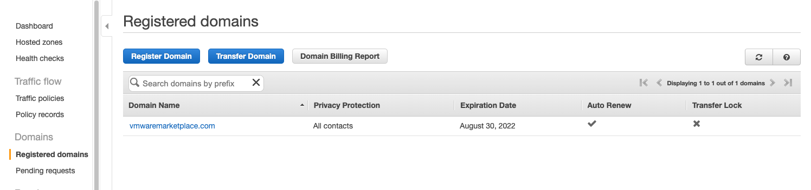
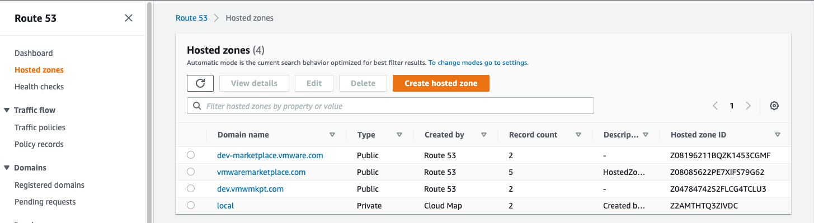
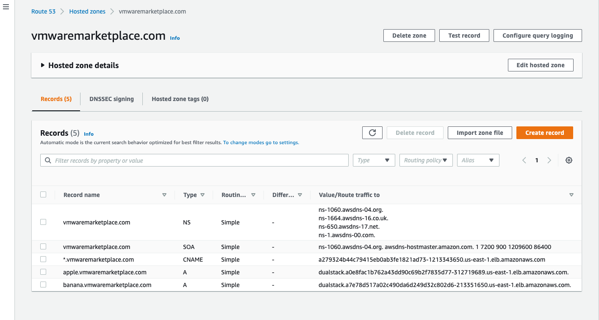
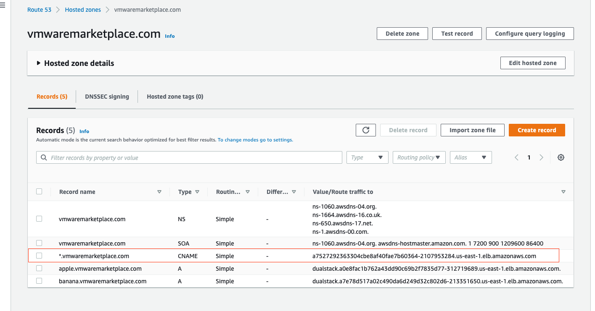

# TAP Installation with Basic Supply-Chain Specifics Guide

This document aims to provide details on Kubernetes and Tanzu configurations required for TAP installation.

### EKS Cluster

Create an EKS Cluster on AWS. Use that EKS cluster (tap100-eks-OXbaeXYM) to configure TAP as below


-  Setup kubeconfig to AWS EKS
```
aws eks update-kubeconfig --name tap100-eks-OXbaeXYM --kubeconfig satya-eks-us-east1-tap100-eks-OXbaeXYM.yaml
export KUBECONFIG=~/satya-eks-us-east1-tap100-eks-OXbaeXYM.yaml
kubectl config get-contexts
kubectl config use-context   arn:aws:eks:us-east-1:192499874028:cluster/tap100-eks-OXbaeXYM
```

```
✗ kubectl config get-contexts
CURRENT   NAME                                                             CLUSTER                                                          AUTHINFO                                                         NAMESPACE
*         arn:aws:eks:us-east-1:192499874028:cluster/tap100-eks-OXbaeXYM   arn:aws:eks:us-east-1:192499874028:cluster/tap100-eks-OXbaeXYM   arn:aws:eks:us-east-1:192499874028:cluster/tap100-eks-OXbaeXYM

✗ kubectl config use-context   arn:aws:eks:us-east-1:192499874028:cluster/tap100-eks-OXbaeXYM
Switched to context "arn:aws:eks:us-east-1:192499874028:cluster/tap100-eks-OXbaeXYM".
✗
```

### Basic Testing
Verify EKS cluster with simple http-echo servers

- Sample Loadbalancer Service pod and service specs
```
cd k8s_services
kubectl apply -f echo-server/nginx-traffic-pod.yaml
kubectl apply -f echo-server/nginx-service-lb.yaml
```


```
✗ kubectl get all -n nginx-sample-traffic
NAME             READY   STATUS    RESTARTS   AGE
pod/apple-app    1/1     Running   0          73m
pod/banana-app   1/1     Running   0          73m

NAME                     TYPE           CLUSTER-IP     EXTERNAL-IP                                                              PORT(S)          AGE
service/apple-service    LoadBalancer   172.20.3.22    a0e8fac1b762a43dd90c69b2f7835d77-312719689.us-east-1.elb.amazonaws.com   5678:30917/TCP   72m
service/banana-service   LoadBalancer   172.20.26.40   a7e78d517a02c490da6d249d32c802d6-213351650.us-east-1.elb.amazonaws.com   5678:31753/TCP   72m

✗ curl http://a0e8fac1b762a43dd90c69b2f7835d77-312719689.us-east-1.elb.amazonaws.com:5678
apple
✗ curl http://a7e78d517a02c490da6d249d32c802d6-213351650.us-east-1.elb.amazonaws.com:5678
banana
```

#### AWS Route53 Configuration

1. Register Domain

    Route 53 -> Registered domains -> Register Domain

    Domain Name: vmwaremarketplace.com

    

1. Create Hosted Zone
    Route 53 -> Hosted zones -> Create hosted zone

    

1. Create Records

    Record Name:apple.vmwaremarketplace.com

    Record Type: A

    Value: Alias to Loadbalancer EXTERNAL-IP


    

1. Test DNS names

    ```
    ✗ curl http://apple.vmwaremarketplace.com:5678
    apple
    ✗ curl http://banana.vmwaremarketplace.com:5678
    banana
    ```

### PREPARE Cluster:

Install Cluster Essentials for VMware Tanzu

- Setup Registry Credentials
```
export INSTALL_REGISTRY_USERNAME=
export INSTALL_REGISTRY_PASSWORD=YOUR_PASSWORD
export INSTALL_REGISTRY_HOSTNAME=

echo $INSTALL_REGISTRY_USERNAME
echo $INSTALL_REGISTRY_PASSWORD
echo $INSTALL_REGISTRY_HOSTNAME

docker login $INSTALL_REGISTRY_HOSTNAME -u $INSTALL_REGISTRY_USERNAME -p $INSTALL_REGISTRY_PASSWORD
```

- Setup Bundle & run install

```

➜  tanzu-tap ls tanzu-cluster-essentials
bundle                                          install.sh                                      kbld                                            ytt
imgpkg                                          kapp                                            tanzu-cluster-essentials-darwin-amd64-1.0.0.tgz

export INSTALL_BUNDLE=registry.tanzu.vmware.com/tanzu-cluster-essentials/cluster-essentials-bundle@sha256:82dfaf70656b54dcba0d4def85ccae1578ff27054e7533d08320244af7fb0343

cd  tanzu-cluster-essentials
tanzu-cluster-essentials ./install.sh

```

- Verify
```
➜  tanzu-cluster-essentials  kapp ls -A
Target cluster 'https://09E92133572A1F84BED66CB9EE154868.gr7.us-east-1.eks.amazonaws.com' (nodes: ip-10-10-3-59.ec2.internal, 3+)

Apps in all namespaces

Namespace                 Name                  Namespaces                             Lcs   Lca
tanzu-cluster-essentials  kapp-controller       (cluster),kapp-controller,kube-system  true  4m
^                         secretgen-controller  (cluster),secretgen-controller         true  3m

Lcs: Last Change Successful
Lca: Last Change Age

2 apps

Succeeded
➜  tanzu-cluster-essentials
```

### PREPARE NAMESPACE:

Follow [GUID-install.html#install-package](https://docs-staging.vmware.com/en/Tanzu-Application-Platform/1.0/tap/GUID-install.html)


- Create a registry secret
```
kubectl create ns tap-install

tanzu secret registry add tap-registry \
  --username ${INSTALL_REGISTRY_USERNAME} --password ${INSTALL_REGISTRY_PASSWORD} \
  --server ${INSTALL_REGISTRY_HOSTNAME} \
  --export-to-all-namespaces --yes --namespace tap-install

tanzu secret registry list --namespace tap-install

kubectl get secret tap-registry  -o jsonpath='{.data.\.dockerconfigjson}'  -n tap-install | base64 --decode
```

- Add tanzu repository
```
export TAP_VERSION=1.0.0

tanzu package repository add tanzu-tap-repository \
  --url registry.tanzu.vmware.com/tanzu-application-platform/tap-packages:$TAP_VERSION \
  --namespace tap-install

```


- Verify


```
tanzu package repository list --namespace tap-install
tanzu package repository get tanzu-tap-repository --namespace tap-install
tanzu package available list --namespace tap-install
tanzu package available list tap.tanzu.vmware.com --namespace tap-install

```

```
➜  tanzu package repository list --namespace tap-install
| Retrieving repositories...
  NAME                  REPOSITORY                                                         TAG    STATUS               DETAILS
  tanzu-tap-repository  registry.tanzu.vmware.com/tanzu-application-platform/tap-packages  1.0.0  Reconcile succeeded

➜  tanzu package repository get tanzu-tap-repository --namespace tap-install
- Retrieving repository tanzu-tap-repository...
NAME:          tanzu-tap-repository
VERSION:       16883
REPOSITORY:    registry.tanzu.vmware.com/tanzu-application-platform/tap-packages
TAG:           1.0.0
STATUS:        Reconcile succeeded
REASON:
```

### Install TAP


1. Setup Registry Credentials

    ```
    export KP_REGISTRY_USERNAME=
    export KP_REGISTRY_PASSWORD=YOUR_PASSWORD
    export KP_REGISTRY_HOSTNAME=

    echo $KP_REGISTRY_USERNAME
    echo $KP_REGISTRY_PASSWORD
    echo $KP_REGISTRY_HOSTNAME

    docker login $KP_REGISTRY_HOSTNAME -u $KP_REGISTRY_USERNAME -p $KP_REGISTRY_PASSWORD
    ```

1. Create a registry secret & add it to a developer namespace

    ```
    export YOUR_NAMESPACE=mydev-ns

    echo $YOUR_NAMESPACE

    kubectl create ns $YOUR_NAMESPACE

    tanzu secret registry add registry-credentials --server $KP_REGISTRY_HOSTNAME --username $KP_REGISTRY_USERNAME --password $KP_REGISTRY_PASSWORD --namespace $YOUR_NAMESPACE

    kubectl get secret registry-credentials  -o jsonpath='{.data.\.dockerconfigjson}'  -n $YOUR_NAMESPACE| base64 --decode
    ```

1. Create a TAP Profile

    File name: tap-values-full-tanzu.yaml

    ```yaml
      ---
      profile: full
      ceip_policy_disclosed: true
      buildservice:
        kp_default_repository: "YOUR_ECR_REPO"
        kp_default_repository_username: "YOUR_USERNAME"
        kp_default_repository_password: "YOUR_PASSWORD"
        tanzunet_username: "YOUR_USERNAME"
        tanzunet_password: "YOUR_PASSWORD"
        descriptor_name: "tap-1.0.0-full"
        enable_automatic_dependency_updates: false
      supply_chain: basic

      cnrs:
        domain_name: vmwaremarketplace.com

      ootb_supply_chain_basic:
        registry:
          server: "YOUR_ECR_REPO_HOSTNAME"
          repository: "YOUR_ECR_REPO"
        gitops:
          ssh_secret: ""

      learningcenter:
        ingressDomain: "vmwaremarketplace.com"

      contour:
        envoy:
          service:
            type: LoadBalancer

      tap_gui:
        service_type: LoadBalancer
        ingressEnabled: "true"
        ingressDomain: "vmwaremarketplace.com"
        app_config:
          app:
            baseUrl: http://tap-gui.vmwaremarketplace.com
          catalog:
            locations:
              - type: url
                target: https://github.com/banicr/tap-1/blob/main/catalog-info.yaml
          backend:
            baseUrl: http://tap-gui.vmwaremarketplace.com
            cors:
              origin: http://tap-gui.vmwaremarketplace.com


    ```


1. TAP Install

    Follow [GUID-install.html#install-package](https://docs-staging.vmware.com/en/Tanzu-Application-Platform/1.0/tap/GUID-install.html#install-package)


    ```
      tanzu package install tap100-eks -p tap.tanzu.vmware.com -v $TAP_VERSION --values-file tap-values-full-tanzu.yaml -n tap-install

    ```

    - Verify

    ```
    tanzu package installed list -A
    tanzu package installed get tap100-eks -n tap-install
    ```

    ```
      ➜  tap-install-instructions  tanzu package installed list -A
      / Retrieving installed packages...
        NAME                      PACKAGE-NAME                                        PACKAGE-VERSION  STATUS               NAMESPACE
        accelerator               accelerator.apps.tanzu.vmware.com                   1.0.0            Reconcile succeeded  tap-install
        api-portal                api-portal.tanzu.vmware.com                         1.0.8            Reconcile succeeded  tap-install
        appliveview               run.appliveview.tanzu.vmware.com                    1.0.1            Reconcile succeeded  tap-install
        appliveview-conventions   build.appliveview.tanzu.vmware.com                  1.0.1            Reconcile succeeded  tap-install
        buildservice              buildservice.tanzu.vmware.com                       1.4.2            Reconcile succeeded  tap-install
        cartographer              cartographer.tanzu.vmware.com                       0.1.0            Reconcile succeeded  tap-install
        cert-manager              cert-manager.tanzu.vmware.com                       1.5.3+tap.1      Reconcile succeeded  tap-install
        cnrs                      cnrs.tanzu.vmware.com                               1.1.0            Reconcile succeeded  tap-install
        contour                   contour.tanzu.vmware.com                            1.18.2+tap.1     Reconcile succeeded  tap-install
        conventions-controller    controller.conventions.apps.tanzu.vmware.com        0.5.0            Reconcile succeeded  tap-install
        developer-conventions     developer-conventions.tanzu.vmware.com              0.5.0-build.1    Reconcile succeeded  tap-install
        fluxcd-source-controller  fluxcd.source.controller.tanzu.vmware.com           0.16.0           Reconcile succeeded  tap-install
        grype                     grype.scanning.apps.tanzu.vmware.com                1.0.0            Reconcile succeeded  tap-install
        image-policy-webhook      image-policy-webhook.signing.apps.tanzu.vmware.com  1.0.0            Reconcile succeeded  tap-install
        learningcenter            learningcenter.tanzu.vmware.com                     0.1.0            Reconcile succeeded  tap-install
        learningcenter-workshops  workshops.learningcenter.tanzu.vmware.com           0.1.0            Reconcile succeeded  tap-install
        metadata-store            metadata-store.apps.tanzu.vmware.com                1.0.1            Reconcile succeeded  tap-install
        ootb-delivery-basic       ootb-delivery-basic.tanzu.vmware.com                0.5.1            Reconcile succeeded  tap-install
        ootb-supply-chain-basic   ootb-supply-chain-basic.tanzu.vmware.com            0.5.1            Reconcile succeeded  tap-install
        ootb-templates            ootb-templates.tanzu.vmware.com                     0.5.1            Reconcile succeeded  tap-install
        scanning                  scanning.apps.tanzu.vmware.com                      1.0.0            Reconcile succeeded  tap-install
        service-bindings          service-bindings.labs.vmware.com                    0.6.0            Reconcile succeeded  tap-install
        services-toolkit          services-toolkit.tanzu.vmware.com                   0.5.0            Reconcile succeeded  tap-install
        source-controller         controller.source.apps.tanzu.vmware.com             0.2.0            Reconcile succeeded  tap-install
        spring-boot-conventions   spring-boot-conventions.tanzu.vmware.com            0.3.0            Reconcile succeeded  tap-install
        tap-gui                   tap-gui.tanzu.vmware.com                            1.0.1            Reconcile succeeded  tap-install
        tap-telemetry             tap-telemetry.tanzu.vmware.com                      0.1.2            Reconcile succeeded  tap-install
        tap100-eks                tap.tanzu.vmware.com                                1.0.0            Reconcile succeeded  tap-install
        tekton-pipelines          tekton.tanzu.vmware.com                             0.30.0           Reconcile succeeded  tap-install


      ➜  tap-install-instructions     tanzu package installed get tap100-eks -n tap-install
      \ Retrieving installation details for tap100-eks...
      NAME:                    tap100-eks
      PACKAGE-NAME:            tap.tanzu.vmware.com
      PACKAGE-VERSION:         1.0.0
      STATUS:                  Reconcile succeeded
      CONDITIONS:              [{ReconcileSucceeded True  }]
      USEFUL-ERROR-MESSAGE:

    ```


### Workload 

Follow [GUID-getting-started.html](https://docs-staging.vmware.com/en/Tanzu-Application-Platform/1.0/tap/GUID-getting-started.html)

Follow [GUID-install-components.html](https://docs.vmware.com/en/Tanzu-Application-Platform/1.0/tap/GUID-install-components.html#setup)

Set up developer namespaces to use installed packages

1. Setup Developer Registry Credentials

    **SAME STEP AS ABOVE IN TAP INSTALL**

1. Create a registry secret & add it to a developer namespace

    **SAME STEP AS ABOVE IN TAP INSTALL**

1. Add secrets, a service account, and RBAC rules to the developer namespace

      File name: my-dev-setup.yaml

      ```yaml
          ---
          apiVersion: v1
          kind: Secret
          metadata:
            name: tap-registry
            annotations:
              secretgen.carvel.dev/image-pull-secret: ""
          type: kubernetes.io/dockerconfigjson
          data:
            .dockerconfigjson: e30K
          ---
          apiVersion: v1
          kind: ServiceAccount
          metadata:
            name: default
          secrets:
            - name: registry-credentials
          imagePullSecrets:
            - name: registry-credentials
            - name: tap-registry
          ---
          apiVersion: rbac.authorization.k8s.io/v1
          kind: Role
          metadata:
            name: default
          rules:
            - apiGroups: [source.toolkit.fluxcd.io]
              resources: [gitrepositories]
              verbs: ['*']
            - apiGroups: [source.apps.tanzu.vmware.com]
              resources: [imagerepositories]
              verbs: ['*']
            - apiGroups: [carto.run]
              resources: [deliverables, runnables]
              verbs: ['*']
            - apiGroups: [kpack.io]
              resources: [images]
              verbs: ['*']
            - apiGroups: [conventions.apps.tanzu.vmware.com]
              resources: [podintents]
              verbs: ['*']
            - apiGroups: [""]
              resources: ['configmaps']
              verbs: ['*']
            - apiGroups: [""]
              resources: ['pods']
              verbs: ['list']
            - apiGroups: [tekton.dev]
              resources: [taskruns, pipelineruns]
              verbs: ['*']
            - apiGroups: [tekton.dev]
              resources: [pipelines]
              verbs: ['list']
            - apiGroups: [kappctrl.k14s.io]
              resources: [apps]
              verbs: ['*']
            - apiGroups: [serving.knative.dev]
              resources: ['services']
              verbs: ['*']
            - apiGroups: [servicebinding.io]
              resources: ['servicebindings']
              verbs: ['*']
            - apiGroups: [services.apps.tanzu.vmware.com]
              resources: ['resourceclaims']
              verbs: ['*']
            - apiGroups: [scanning.apps.tanzu.vmware.com]
              resources: ['imagescans', 'sourcescans']
              verbs: ['*']
          ---
          apiVersion: rbac.authorization.k8s.io/v1
          kind: RoleBinding
          metadata:
            name: default
          roleRef:
            apiGroup: rbac.authorization.k8s.io
            kind: Role
            name: default
          subjects:
            - kind: ServiceAccount
              name: default

      ```

      ```
      kubectl -n $YOUR_NAMESPACE apply -f my-dev-setup.yaml
      ```

#### Example-1

- CREATE

  ```
  tanzu apps workload create tanzu-java-web-app \
    --git-repo https://github.com/sample-accelerators/tanzu-java-web-app \
    --git-branch main \
    --type web \
    --label app.kubernetes.io/part-of=tanzu-java-web-app \
    -n $YOUR_NAMESPACE \
    --yes
  ```


- VERIFY

  ```
  tanzu apps workload list -n $YOUR_NAMESPACE
  tanzu apps workload tail tanzu-java-web-app -n $YOUR_NAMESPACE --since 10m --timestamp
  tanzu apps workload get tanzu-java-web-app -n $YOUR_NAMESPACE
  ```

- Accessing the service

  ```
  tanzu apps workload get tanzu-java-web-app -n $YOUR_NAMESPACE
  # tanzu-java-web-app: Ready
  ---
  lastTransitionTime: "2022-03-18T20:01:07Z"
  message: ""
  reason: Ready
  status: "True"
  type: Ready

  Workload pods
  NAME                                                   STATE       AGE
  tanzu-java-web-app-00001-deployment-7cbb575797-2n86h   Running     48s
  tanzu-java-web-app-build-1-build-pod                   Succeeded   4m21s
  tanzu-java-web-app-config-writer-74w2r-pod             Succeeded   2m34s

  Workload Knative Services
  NAME                 READY   URL
  tanzu-java-web-app   Ready   http://tanzu-java-web-app.mydev-ns.vmwaremarketplace.com
  ```


  **Ingress Method**

  - Update TAP profile tap-values-full-tanzu.yaml
  ```
  contour:
  envoy:
    service:
      type: LoadBalancer
  ```

  - Apply
  ```
  tanzu package installed update tap100-eks  -p tap.tanzu.vmware.com -v $TAP_VERSION --values-file tap-values-full-tanzu.yaml -n tap-install
  ```

  - Get the ingress address
  ```
  kubectl get service envoy -n tanzu-system-ingress
  NAME    TYPE           CLUSTER-IP       EXTERNAL-IP                                                               PORT(S)                      AGE
  envoy   LoadBalancer   172.20.167.108   a7527292363304cbe8af40fae7b60364-2107953284.us-east-1.elb.amazonaws.com   80:30591/TCP,443:32431/TCP   79m
  ```

  - Add the above EXTERNAL-IP to the DNS record

        * Create Route-53 by using the following steps:

          Navigate to Route-53 records in AWS.
          Go to → Services → Route-53 → Hosted Zones → domain (vmwaremarketplace.com) → Create a Record
            Record Name :*.vmwaremarketplace.com
            Record Type: CNAME
            Value: Alias to Loadbalancer EXTERNAL-IP


      

  - Access service

  ```
  curl http://tanzu-java-web-app.mydev-ns.vmwaremarketplace.com
  Greetings from Spring Boot + Tanzu!
  ```

#### Example-2

Same example as above using workload config file

- CREATE

  workload file: config/workload-aws.yaml
    ```
    cd tanzu-java-web-app
    cat config/workload-aws.yaml

      apiVersion: carto.run/v1alpha1
      kind: Workload
      metadata:
        name: aws-tanzu-java-web-app-workload
        labels:
          apps.tanzu.vmware.com/workload-type: web
          app.kubernetes.io/part-of: aws-tanzu-java-web-app-workload
      spec:
        params:
        - name: annotations
          value:
            autoscaling.knative.dev/minScale: "1"
        source:
          git:
            url: https://github.com/sample-accelerators/tanzu-java-web-app
            ref:
              branch: main
    ```

    ```
    tanzu apps workload apply -f config/workload-aws.yaml --namespace  $YOUR_NAMESPACE
    ```

- VERIFY

  ```
    tanzu apps workload list -n $YOUR_NAMESPACE
    tanzu apps workload tail aws-tanzu-java-web-app-workload -n $YOUR_NAMESPACE --since 10m --timestamp
    tanzu apps workload get aws-tanzu-java-web-app-workload -n $YOUR_NAMESPACE
  ```

- Accessing the service

  ```
  tanzu apps workload get  aws-tanzu-java-web-app-workload -n $YOUR_NAMESPACE
  # aws-tanzu-java-web-app-workload: Ready
  ---
  lastTransitionTime: "2022-03-18T20:39:31Z"
  message: ""
  reason: Ready
  status: "True"
  type: Ready

  Workload pods
  NAME                                                      STATE       AGE
  aws-tanzu-java-web-app-workload-build-1-build-pod         Succeeded   4m7s
  aws-tanzu-java-web-app-workload-config-writer-sgc94-pod   Succeeded   2m25s

  Workload Knative Services
  NAME                              READY   URL
  aws-tanzu-java-web-app-workload   Ready   http://aws-tanzu-java-web-app-workload.mydev-ns.vmwaremarketplace.com
  ```

  ```
  curl http://aws-tanzu-java-web-app-workload.mydev-ns.vmwaremarketplace.com
  Greetings from Spring Boot + Tanzu!
  ```

###  Unwide / Uninstall

  ```
  tanzu apps workload delete tanzu-java-web-app -n  $YOUR_NAMESPACE --yes

  tanzu apps workload delete aws-tanzu-java-web-app-workload  -n  $YOUR_NAMESPACE --yes

  tanzu package repository delete tanzu-tap-repository  --namespace tap-install

  tanzu package installed delete tap100-eks -n tap-install


  tanzu secret registry delete  registry-credentials --namespace $YOUR_NAMESPACE
  tanzu secret registry delete  tap-registry --namespace tap-install

  ```


### Web Reference
1. [docs-tap](https://github.com/pivotal/docs-tap)
1. [GUID-install-intro.html](https://docs-staging.vmware.com/en/Tanzu-Application-Platform/1.0/tap/GUID-install-intro.html)
1. [GUID-prerequisites.html](https://docs.vmware.com/en/Tanzu-Application-Platform/1.0/tap/GUID-prerequisites.html)